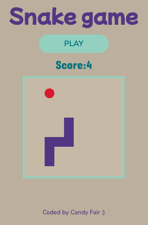

# Snake game

This is a JavaScript grid-based version of the Nokia 3310 Snake game.

The game can be played [here](https://snake-rose.vercel.app).

## Overview

Users click on the "Play" button and they become a tiny snake who feeds on apple. Each time the snake eats an apple, it grows in size and it moves faster. The goal is to eat as many apples as possible without touching the borders and touching the snake's own body. 


### Screenshot




## My process

### Built with

- Semantic HTML5 markup
- CSS custom properties
- Flexbox
- JavaSCript

### What I learned

It was the first time I was using the CSS `animation` property to make the background blink when the snake eats an apple and when the player losed the game:

```css
.blink-lost {
    animation: blinkLost 200ms infinite;
}

@keyframes blinkLost{ 
    0%, 49% { background-color: #5c3c92; } 
    50%, 100% { background-color:#d72631; } 
}
```


### Continued development

Right now the game can only be played on a computer, because a keyboard is needed. I want to add touch-sensitive buttons that will be displayed on smartphones and tablets so users can play from these devices too. 

I also want to allow users to customise the size of the grid, so it doesn't look so small on big screens. 


## Author

- Website - [Candy Fair Studio](https://www.candyfairstudio.com)
- Frontend Mentor - [@Candyfair](https://www.frontendmentor.io/profile/Candyfair)
- Twitter - [@candy_fair](https://twitter.com/candy_fair)

